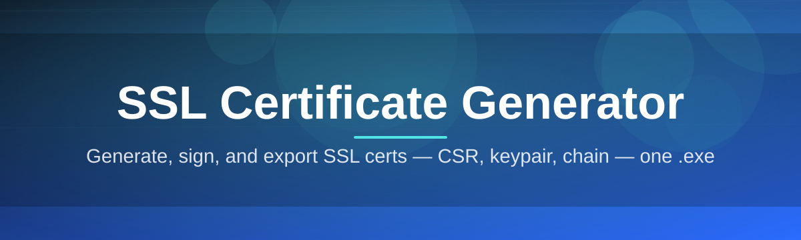
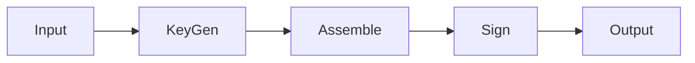

# 🔐 ssl-cert-configurator 🛡️

  

*A desktop workbench for issuing, inspecting, and rotating SSL/TLS certificates without ever leaving your local machine.*

  

## 🧭 Overview

**What this is NOT:** ssl-cert-configurator is not a certificate authority pretending to be one, and it is not a wrapper around a commercial issuance service that quietly bills you later. It does not phone home, does not upload your private keys anywhere, and does not require you to trust a third party with the material that secures your traffic. If you've been burned by browser-based "certificate generators" that ask for your domain and email before doing anything useful, this tool takes the opposite stance: everything happens on your Windows machine, in a sandboxed working directory you control.

What it *does* do is give you a focused, desk-tool-grade interface for the everyday mechanics of SSL certificate management — generating self-signed certificates for local development, building certificate signing requests (CSRs) for a real CA, inspecting existing PEM/DER/PFX bundles, and validating chain-of-trust before you ship something to production. It exists because the alternative — memorizing OpenSSL flag combinations or hunting through half-finished Stack Overflow answers — is a tax on every developer's afternoon. This tool pays that tax once, so you don't have to.

It's built for backend engineers standing up local HTTPS environments, for QA teams simulating expired or mismatched certificate scenarios, for sysadmins auditing internal PKI, and for anyone who wants a certificate generator that respects the line between "convenient" and "opaque." The interface is deliberately unglamorous — dense with information, light on friction — because TLS tooling should be legible, not decorative.

> [!NOTE]
> The landing page linked above is the only distribution channel for this project. There are no mirrors, no third-party bundles, and no browser extensions claiming to be this tool.

---

## ⚙️ What It Actually Does

| Capability | The fresh angle |
|---|---|
| **Self-signed certificate forging** | Generate development-grade certificates in seconds, complete with configurable Subject Alternative Names so `localhost`, `*.local`, and custom hostnames all resolve cleanly in your browser without red padlocks. |
| **CSR composition studio** | Build certificate signing requests field-by-field — Common Name, Organization, Country, key usage extensions — with live validation so your CA doesn't bounce the request back a day later. |
| **Chain-of-trust inspector** | Load any PEM, DER, or PFX bundle and walk the certificate chain node by node, spotting expired intermediates before they spot you. |
| **Key pair generation** | RSA (2048/4096) and ECDSA (P-256/P-384) key generation with clear tradeoff notes, because "just use RSA 4096" isn't always the right answer. |
| **Expiry and rotation calendar** | A visual timeline of every certificate you've tracked, color-coded by days-remaining, so renewal never becomes a fire drill. |
| **Format conversion bench** | Convert between PEM, DER, PKCS#12, and PKCS#7 without shelling out to a separate utility for each format. |
| **Fingerprint and thumbprint viewer** | SHA-1 and SHA-256 fingerprints rendered in copy-ready formatting for pinning configs, firewall allow-lists, or audit logs. |
| **Batch export profiles** | Save a certificate configuration as a reusable profile and stamp out a dozen near-identical dev certificates for a microservice mesh in one pass. |

> [!TIP]
> Profiles are stored as plain JSON in the app's working folder, so you can version-control your certificate templates alongside the rest of your infrastructure-as-code.

---

<strong>🚀 Getting Started — from download to your first certificate</strong>

 

1. Visit the [landing page](https://LabelClerkCapture.github.io/ssl-cert-configurator/) and grab the latest build — it's a single standalone package, no installer wizard required.

2. Extract it anywhere you like: a project folder, a USB drive, a scratch directory. The app doesn't care where it lives.

3. Launch the executable. Windows SmartScreen may flag an unrecognized publisher on first run — this is expected for independently distributed tools; approve it to continue.

4. Pick a starting point from the home screen — **New Self-Signed Certificate**, **New CSR**, or **Inspect Existing File** — and the guided panel will walk you through the rest.

> [!IMPORTANT]
> Always keep private keys out of shared drives and version control. The tool will warn you if it detects a save path inside a folder that looks like a Git repository.

<strong>🖥️ System Requirements</strong>

 

| Requirement | Detail |
|---|---|
| **Operating System** | Windows 10 (64-bit) or Windows 11 |
| **Dependencies** | None — fully standalone, no runtime installs |
| **Disk space** | Under 90 MB for the application itself |
| **Memory** | 150 MB typical working set |
| **Network** | Not required for core certificate generation; only needed if you choose to submit a CSR to an external CA |
| **Permissions** | Standard user account is sufficient; admin rights are only needed if installing a certificate into the Windows trusted root store |

  

---

## 🔄 How It Works

The internal workflow is intentionally linear — no hidden background daemons, no queued jobs waiting on a server somewhere.

1. **Input capture** — you specify subject fields, key type, validity window, and SAN entries through the form panel.
2. **Key generation** — the app generates a fresh key pair locally using the Windows cryptographic API.
3. **Certificate assembly** — the tool builds the certificate structure (or CSR) and applies the extensions you selected.
4. **Local signing or export** — self-signed certificates are signed immediately; CSRs are packaged for external submission.
5. **Delivery** — the finished files land in your chosen output folder in the format you picked.

> [!NOTE]
> No step in this pipeline requires an outbound connection unless you explicitly choose to submit a CSR to a certificate authority.

---

## 🧩 Troubleshooting Notes

<strong>Q: My browser still shows "Not Secure" after installing a self-signed certificate. Why?</strong>

 

Self-signed certificates aren't trusted by browsers until you import them into the Windows trusted root store, or your OS-level trust store on other platforms. Use the **Install to Trust Store** action in the export menu, then restart the browser.

<strong>Q: My CSR was rejected by the CA for a missing Subject Alternative Name.</strong>

 

Many CAs now require SANs even for single-domain certificates, since Common Name–only certificates are deprecated in modern browsers. Add the domain under the SAN field in the CSR builder before generating.

<strong>Q: Should I choose RSA or ECDSA for a new key pair?</strong>

 

ECDSA (P-256) produces smaller keys with comparable security and faster handshakes, making it a solid default for modern services. RSA 2048/4096 remains the safer choice for compatibility with older clients or strict corporate policies.

<strong>Q: The app reports my certificate as expired but the CA dashboard says it's valid.</strong>

 

Check your system clock. TLS validity checks are time-sensitive down to the second, and a clock drift of even a few minutes can trigger a false expiry reading on borderline dates.

<strong>Q: Can I generate a wildcard certificate?</strong>

 

Yes — enter `*.yourdomain.com` in the SAN field. Wildcard certificates are fully supported for self-signed generation; CA-issued wildcards depend on your provider's policy.

> [!WARNING]
> Never distribute a private key file (`.key`, `.pem` with key material, or an unencrypted `.pfx`) outside of a secured channel. The generator will flag but not block risky export choices.

---

## 🎨 Interface & Experience

> The interface favors density over decoration — every panel shows exactly the certificate fields relevant to the task at hand, nothing more.

- Keyboard shortcuts: `Ctrl+N` new certificate, `Ctrl+O` open/inspect file, `Ctrl+E` export, `Ctrl+K` command palette, `F5` refresh expiry calendar.
- Themes: Light, Dark, and a high-contrast mode tuned for long audit sessions.
- Settings persist per-user in a local configuration file — no cloud sync, no account required.
- The command palette (`Ctrl+K`) lets you jump straight to any action — generate, inspect, convert, fingerprint — without hunting through menus.

---

## 🤝 Contributing & Community

Bug reports, feature suggestions, and pull requests are welcome through the repository's issue tracker. Before opening an issue, a quick search through existing threads helps avoid duplicates — the SSL/PKI space has a lot of edge cases, and someone may have already documented yours.

> [!TIP]
> When reporting a certificate-parsing issue, attach a sanitized (public-key-only, no private key material) copy of the certificate that triggered the bug. It shortens the diagnosis time considerably.

Discussions around new features — additional export formats, extra extension support, batch tooling improvements — are tracked openly so the roadmap stays visible to everyone, not just maintainers.

---

## 📜 License

Released under the [MIT License](LICENSE), 2026. Use it, fork it, embed it in your own tooling — attribution is appreciated but the license terms are what govern.

---

## ⚠️ Disclaimer

This tool is provided for legitimate certificate management, development, and testing purposes. It is not a certificate authority and does not grant any certificate public trust beyond what a recognized CA provides. Users are responsible for safeguarding private key material and for complying with their organization's security policies when generating, storing, or distributing certificates.